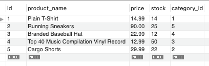

# 13 Object-Relational Mapping (ORM): E-Commerce Back End
[](https://opensource.org/licenses/MIT)


## Table of Contents
* [Introduction](#introduction)
* [Functionality](#functionality)
* [Tasks Completed](#tasks-completed)
* [Technologies Used](#technologies-used)
* [Installations](#installations)
* [Demos](#demos)
* [Known Issue](#known-issue)
* [Sources](#sources)
* [License](#license)


 ## Introduction
 Uses Node, MySql, Insomnia, and the command line to sync the backend server to the MySql data. Routes the database appropriately.
 * GitHub Repository: https://github.com/JXIong15/13-ecommerce
 * [App Demonstration:](https://drive.google.com/file/d/1o0SrNRsSqu0UHwKE7BNGJvuu6fhUxWi0/view)
<p align="center"></p>


## Functionality
* When the program is initiated, the database and tables are created, and the seeds are put in. This is all displayed on the MySql Workbench.
* In Insomnia, the user can test the routes for each table by using API PUT, POST, and DELETE.
* To run the database and seeds:
```
mysql -h HOSTNAME -u USER DATABASE < ./db/schema.sql
Quit
npm run seeds
```


## Tasks Completed
* Dowloaded necessary NPM packages. View [Installations](#installations) below for exact packages.
* Created a connection between the database and server using MySql.
* Created the models for Category, Product, Tag, and ProductTag.
  * Referenced Category in Product
  * Referenced Product and Tag in ProductTag
* Created category, product, and tag routes.
  * each route can GET all the data for that table, GET the element by id, create an element using POST, update and element using PUT, and DELETE an element.


## Installations
* Download NPM and packages:
  * Inquirer (`npm install inquirer`)
  * Node (`npm install node`)
  * Dotenv (`npm install dotenv`)
  * Express (`npm install express`)
  * MySql (`npm install mysql`)
  * MySql2 (`npm install mysql2`)
  * Sequelize (`npm install sequelize`)


## Technologies Used
* JavaScript
* NPM Packages
* Terminal/Command Line
* MySql Workbench
  * Query Conenection
* MySql Server
* Insomnia to test routes


## Demos
Whole App Demo: https://drive.google.com/file/d/1o0SrNRsSqu0UHwKE7BNGJvuu6fhUxWi0/view

* GET Demo:
   <p align="center"></p>

* POST Demo:
   <p align="center"></p>

* UPDATE Demo:
   <p align="center"></p>

* DELETE Demo:
   <p align="center"></p>


## Known Issue
* The `mysql -h root -u ecommerce_db < ./db/schema.sql` on the command line does not work. I'm not sure what package this is, or how to use the MySql shell.


## Sources
* NPM Packages: https://www.npmjs.com/
* MySql Workbench: https://www.mysql.com/products/workbench/
* MySql Server: https://dev.mysql.com/downloads/mysql/
* Insomnia: https://insomnia.rest/download


## License
Licensed under the [MIT License](LICENSE).

<p align="center">© 2021 Jou Xiong, Trilogy, Northwestern Coding Bootcamp</p>
